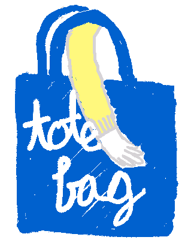

<div style="text-align: center">



# Totebag
*author web pages with your browser (eventually)*

</div>

To install dependencies:

```bash
bun install
```

To run:

```bash
bun run index.ts $WATCH_DIR
```

where `$WATCH_DIR` is whatever you want to start with
